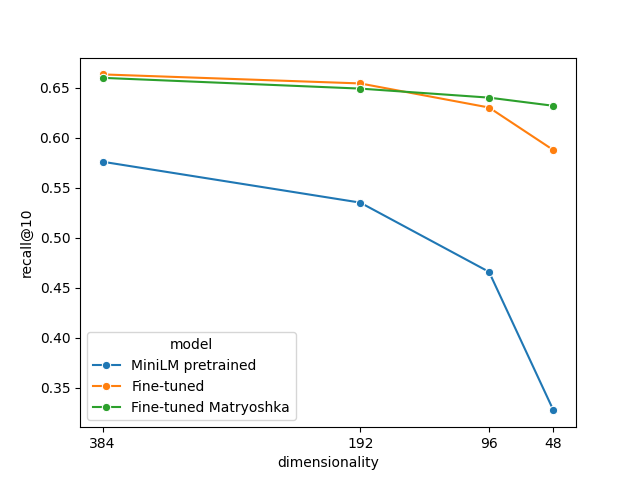

# Fine-Tuning a Sentence Transformer with and without the Matryoshka Loss

### Goals

1. See if I could fine-tune a pre-trained sentence transformer for an information retrieval (IR) task based on a [Home Depot dataset](https://huggingface.co/datasets/bstds/home_depot).

2. [Matryoshka Representation Learning](https://arxiv.org/abs/2205.13147) is a technique for learning embeddings whose dimensionality can be shrunk without significant loss in its semantic content.  I wanted to know if this technique could help to reduce the size of the embeddings without significantly sacrificing the performance in the same IR task.

### The pre-trained model

I chose to fine-tune the [all-MiniLM-L6-v2](https://huggingface.co/sentence-transformers/all-MiniLM-L6-v2) pretrained sentence transformer, because I needed a small model to minimize training time.  Despite its small size (~22.7M parameters), `all-MiniLM-L6-v2` performs reasonably well in the MTEB benchmark (score = 56.26; see [here](https://arxiv.org/pdf/2210.07316)).

### The Dataset

I used a [Home Depot data](https://huggingface.co/datasets/bstds/home_depot) dataset on Hugging Face, which contains real customer search terms from Home Depot's website, the associated product descriptions for the products returned by the website, and a score indicating the relevancy of the returned products (range: [1,3]).  The dataset has 74.1k records.  It was randomly truncated to 25k records for the purpose of my experiments.

### Fine-tuning without the Matryoshka loss

The training dataset was constructed from 80% of the 25k records (the other 20% was used for testing).  I took the query string ("anchor") and the product description ("positive") form records with relevance scores > 2.5.  The distribution of the relevance score appears to be bimodal, with a "dip" around 2.5 - suggesting that it could be used as the threshold for two broad categories of records: good and bad matches.  This 2.5 threshold yielded 9.2k sentence pairs, which was about 46% of the dataset before thresholding. 

I used the sentence pairs to fine-tune the sentence transformer with the [Multiple Negatives Ranking  (MNR)](https://arxiv.org/pdf/1705.00652) loss.  This loss function maximizes the similarity between the anchor and the positive, while minimizing the similarity between the anchors and negatives (those that are not positive).

I briefly experimented with changing the learning rate, the learning rate schedule, and batch size, but ended up using the default trainer and 30 epochs.

I very briefly tried the Cosine Similarity loss to directly inform the embedding with the relevancy score metric, but the attempt was unsuccessful.  CoSENT loss should produce better results but I didn't get to try it. 

### Fine-tuning with the Matryoshka loss

I performed an additional experiment, where the Matryoshka loss was used on top of the Multiple Negative Ranking loss, to preserve the relationships of the embeddings if the dimensionality of the pretrained model (384) was truncated 192, 96, and 48.

### Testing

A test set was constructed from 20% of the 25k records. Neither the queries nor the product descriptions in the test set were used in training. Again, the 2.5 relevancy score was used as the threshold for queries that lead to good product matches, yielding 2327 queries for a corpus of 5064 product descriptions. 

Assuming that customers are only interested in (or are only shown) the top 10 ranked retrieved items, I used two metrics to examine the performance of the embeddings:

- `recall@10`: The percentage of relevant products that appear in the top 10 retrieved items.
- `MRR@10`: The averaged inverse of the position of the first relevant item in the top 10 retrieved items.

### Comparing the performances of the 3 embeddings without truncation

The table below shows the metrics when untruncated embeddings (dimensionality = 384) were used in the IR task. The model fine-tuned without the Matryoshka loss slightly improved both metrics (15.2% for `recall@10` and 15.4% for `MRR@10`).  

The use of the Matryoshka loss came with a slight cost: the metrics were slightly lower when compared to the model fine-tuned without it, but they were still higher than the pretrained model.  In the next section, we'll see if the Matryoshka embedding had some benefits (i.e., flexibility in embeddding dimensionality).

<table id="customers">
  <tr>
    <th>Model</th>
    <th>recall@10</th>
    <th>MRR@10</th>
  </tr>
  <tr>
    <td>MiniLM pretrained</td>
    <td>0.5758</td>
    <td>0.3203</td>
  </tr>
  <tr>
    <td>Fine-tuned</td>
    <td>0.6631</td>
    <td>0.3695</td>
  </tr>
  <tr>
    <td>Fine-tuned Matryoshka</td>
    <td>0.6596</td>
    <td>0.3590</td>
  </tr>  
</table>

Interestingly, I also compared these numbers against those evaluated with a much larger pretrained sentence transformer - [all-mpnet-base-v2](https://huggingface.co/sentence-transformers/all-mpnet-base-v2) with 109M parameters (embedding dimensionality = 768). `recall@10` was 0.5952 and `MRR@10` was 0.3276.  They were better than the pretrained MiniLM, but not better than the fine-tuned models.

### Comparing the performances of the 3 embeddings with truncation

The Matryoshka embedding was designed to be "shrinkable", meaning that truncating the vectors should have less negative effects on semantic-related tasks, compared to embeddings without the Matryoshka loss.  To validate this, I evaluated `recall@10` and `MRR@10` for the 3 embeddings, when the vectors where truncated to have dimensionality 192, 96, and 48.

The `recell@10` results are plotted below (the numerical values, as well as MRR@10 results are in [this notenook](analysis.ipynb)).

- Observation #1: `recall@10` for the pretrained MiniLM model (blue line) declines significantly as the embeddings were truncated.  The deterioration was most pronounced when the vectors were reduced to 1/8 of its original dimensionality (from 384 to 48), were `recall@10` was reduced by 43% (from 0.576 to 0.327). 

- Observation #2: Even without using the Matryoshka loss (orange line), it was possible to truncate the embedding by half (from 384 to 192) without significant reduction in `recall@10` (0.663 to 0.654, or 1.36%; for the pre-trained model, it was 7.1%).  Further reducing the dimensionality led to larger changes in `recall@10`.  When the vector was truncated to 48 dimension, `recall@10` was reduced by 11.5% (0.663 to 0.587) with respect to the original dimensionality (384).  The effect was not as pronounced as the pretrained model.

- Observation #3: Using the fined-tuned model without the Matryoshka loss, even if the vectors were truncated to 48, the performance (`recall@10`) was still comparable to that of the pretrained MiniLM model with its 384 dimensional embeddings.

- Observation #4: Fine-tuning with the Matryoshka loss (green line) did not show an advantage, when the embedddings were truncated to 192 dimensional.  However, when the dimensionality was reduced to 48, `recall@10` was reduced by 4%, which compared favorably to the model fine-tuned without the Matryoshka loss (11.5%).

### Conclusions

My experiments showed that:

- The pretrained `MiniLM-L6-v2` model could be fine-tuned to improve the performance in an IR task.
- The used of Matryoshka loss in fine-tuning showed some benefits, if the embeddings were to be used in a context where the dimensionality has to be reduced from 384 to 48.

The gains in performance were small, due to the limited time used in the experiments. Further work is needed. The size of the training set should be increased, and the hyperparameters should be optimised by a grid search.
